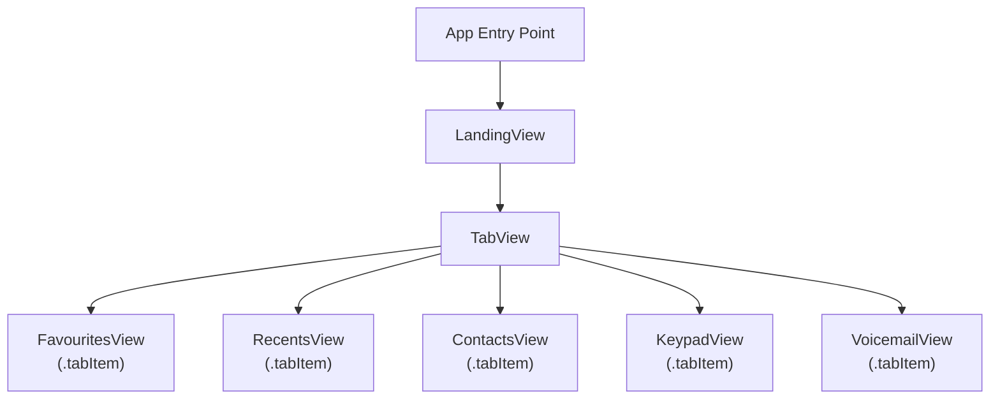

In the Stopwatch tutorial series you learned implicity how to use the **Preview** or **Canvas** area to see your code.

In this mini-tutorial you will explicitly learn the difference between:

- seeing a **Preview** of your code for part of your app
- seeing *all* of your code run on a simulated device

Both ways of running your code have advantages, depending on what you are trying to test.

## Obtain the example project

This will be easier to understand if you have some code to try out while following this mini-tutorial.

The **PhonePrototype** project is an "empty" version of the **Phone** app interface for iOS. Only the tab view at the bottom of the app's interface has been implemented:

![[Screenshot 2023-11-05 at 7.48.22 AM.png]]

Please download [the **PhonePrototype** project shown here](https://github.com/lcs-rgordon/PhonePrototype/archive/493b647beec57540b446f5aa73295a19f0a805a5.zip) so you can try it out.

### Expand the compressed file

When you follow the link above, you will end up with a compressed file in your **Downloads** folder:

![[Screenshot 2023-11-05 at 7.49.33 AM.png|400]]

Double-click to expand the compressed file and you will see a folder whose name starts with **PhonePrototype** and is then followed by a long series of letters and numbers:

![[Screenshot 2023-11-05 at 7.50.44 AM.png|400]]

Two-finger tap or right-click the folder and choose to rename it:

![[Screenshot 2023-11-05 at 7.51.04 AM.png|300]]

Remove the letters and numbers so the name of the folder is just **PhonePrototype**:

![[Screenshot 2023-11-05 at 7.51.30 AM.png|400]]

When you are done you should see something like this:

![[Screenshot 2023-11-05 at 7.52.33 AM.png|400]]

### Organize and open the project

Now move the **PhonePrototype** folder to your own Computer Science folder, wherever that might be.

Then double-click to open the folder, and double-click the **PhonePrototype.xcodeproj** file:

![[Screenshot 2023-11-05 at 7.53.35 AM.png|400]]

You will see a warning dialog box like the following – since you downloaded this project from Mr. Gordon – you can trust it. Go ahead and select **Trust and Open**:

![[Screenshot 2023-11-05 at 7.54.35 AM.png|225]]

After opening the project you will see something like this:

![[Screenshot 2023-11-05 at 7.56.54 AM.png]]

Select the blue **PhonePrototype** project file:

![[Screenshot 2023-11-05 at 7.57.25 AM.png]]

Then select the **Signing & Capabilities** tab:

![[Screenshot 2023-11-05 at 7.58.36 AM.png]]

Finally, from the drop-down for **Team**, select your personal team:

![[Screenshot 2023-11-05 at 7.59.21 AM (2).png]]

Now, you should be able to preview and run the project in the Simulator. We will learn how to do this now...

## Showing the Preview or Canvas

Press **Command-1** to be sure you have the **Project Navigator** open, then expand the **Helpers** and **Views** folders, then select the **LandingView** file. You should see something like this:

![[Screenshot 2023-11-05 at 8.02.38 AM.png]]

If you do not see the **Preview** section at right, sometimes called the **Canvas**, press **Option-Command-Return** on your keyboard, or use the mouse pointer as shown.

The **Preview** or **Canvas** area will appear and disappear:

![[Toggling the Preview Area 1.gif]]

## Starting the Preview

The primary purpose of the **Preview** window is to show just the contents of the *single view*, or file, you are currently working on.

To start the Preview, click the ↻ icon, or use the **Option-Command-P** keyboard shortcut:

![[Screenshot 2023-11-05 at 8.02.38 AM copy 1.png]]

After about 10 seconds (or a few minutes if you have an older computer) you will see the preview appear:

![[Screenshot 2023-11-05 at 11.15.47 AM.png]]

> [!TIP]
> 
> If you know you have an older computer, start the **Preview** window in an Xcode project as soon as you arrive to class (or a few minutes before you want to start coding).
> 
> Once the **Preview** window has loaded the first time, updates after changing code will appear relatively quickly.

## Using the Preview

As mentioned above, the **Preview** window shows a single view or file at a time.

It is code like the following that creates the preview:

```swift
#Preview {
    LandingView()
}
```

In this case, the preview creates an instance of the `LandingView` structure.

As you can see, the `LandingView` structure contains only a `TabView` stucture:

```swift
struct LandingView: View {
    var body: some View {
        TabView {
            
            FavouritesView()
                .tabItem {
                    Image(systemName: "star.fill")
                    Text("Favourites")
                }

            RecentsView()
                .tabItem {
                    Image(systemName: "clock.fill")
                    Text("Recents")
                }

            ContactsView()
                .tabItem {
                    Image(systemName: "person.crop.circle.fill")
                    Text("Contacts")
                }

            KeypadView()
                .tabItem {
                    Image(systemName: "circle.grid.3x3.fill")
                    Text("Keypad")
                }

            VoicemailView()
                .tabItem {
                    Image(systemName: "recordingtape")
                    Text("Voicemail")
                }

        }
    }
}
```

Here is an illustration of the flow:

![[Screenshot 2023-11-05 at 11.17.59 AM.png]]

## Previews vs. Simulator

If we click through the different views of the app, we can see each file in turn appear in the Previews area:

![[Previewing Multiple Files.gif]]

This is fine if we really do just want to see each view on it's own.

What if, however, we want to test the app as a whole?

In that case, we can run the app in the full Simulator.

### Running an app in the Simulator

To run an app in the Simulator, first check that you have an appropriate run destination selected. In this case, the app will run within the iPhone 15 Pro simulator:

![[Screenshot 2023-11-05 at 11.44.16 AM.png]]

Then to run the app in the full Simulator, press **Command-R** or click the ▶️ icon in the Xcode toolbar:

![[Screenshot 2023-11-05 at 11.50.21 AM.png]]

After a moment, you will see the app appear in the Simulator:

![[Screenshot 2023-11-05 at 11.53.32 AM.png|350]]

> [!TIP]
> 
> If you have an older computer, starting the Simulator will take some time.
> 
> However, after the Simulator is loaded for the first time, if you keep it running, the next time you run your code, the new version of your app will appear in the Simulator much more quickly.
> 
> It is also possible to run apps directly on your actual phone, and this process is much faster. A tutorial explaining how to do that will be provided soon.

Note that the app is only showing `FavouritesView` though, and not the full tab view.

Why is that? Let's investigate...

### App entry point

In the **Project navigator** select the **PhonePrototypeApp** file:

![[Screenshot 2023-11-05 at 11.55.55 AM.png]]

On line 10, you'll note the following code:

```swift
@main
```

This is referred to as the **app entry point**.

In the lifecycle of a SwiftUI app running on a device (or a simulated device) this is where your app's code "begins".

The `PhonePrototypeApp` structure, in this example, eventually creates an instance of `FavouritesView`, as shown on line 14:

![[Screenshot 2023-11-05 at 12.02.16 PM.png]]

That is why when we run the app in the simulator, we see this:

![[Screenshot 2023-11-05 at 11.53.32 AM.png|350]]

The app entry point is creating an instance of `FavouritesView`.

For this particular app, that is not very useful.

We can create an instance of whatever structure we want when the app opens.

For example – although this is not particularly useful either – we could instead create an instance of `RecentsView`:

![[Screenshot 2023-11-05 at 12.04.09 PM.png]]

Then we when run the app again in the Simulator by pressing **Command-R**, we see this instead:

![[Screenshot 2023-11-05 at 12.04.40 PM.png|350]]

For this particular app, what we want to do is create an instance of `LandingView` because that is what (in turn) creates a `TabView` – that much is clear when we preview the `LandingView` file:

![[Screenshot 2023-11-05 at 12.08.01 PM.png]]

So if we want to see this same content when the app opens in the full simulator, this is the change should make at the app entry point:

![[Changing What Structure Shows When App Runs.gif]]

Conceptually, this is what we now have:



The app entry point creates an instance of `LandingView`.

`LandingView` creates a `TabView`.

Each tab item inside the `TabView` switches the app's user interface to show an instance of one of these structures:

- `FavouritesView`
- `RecentsView`
- `ContactsView`
- `KeypadView`
- `VoicemailView`

## Summary

When you want to test the functionality of just one view within your app, use the **Previews** window:

![[Screenshot 2023-11-05 at 11.15.47 AM.png]]

When you want to test how the app works as a whole, run it within the full Simulator (or test it on an actual physical device). When an app is run in the Simulator or on a device, the structure created by the app entry point file is what we will see:

![[Screenshot 2023-11-05 at 12.20.05 PM (2).png]]