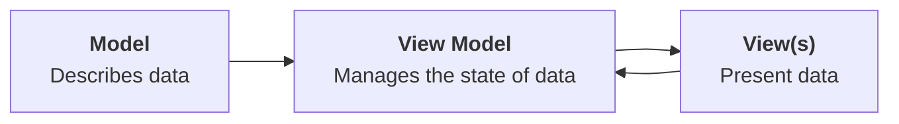
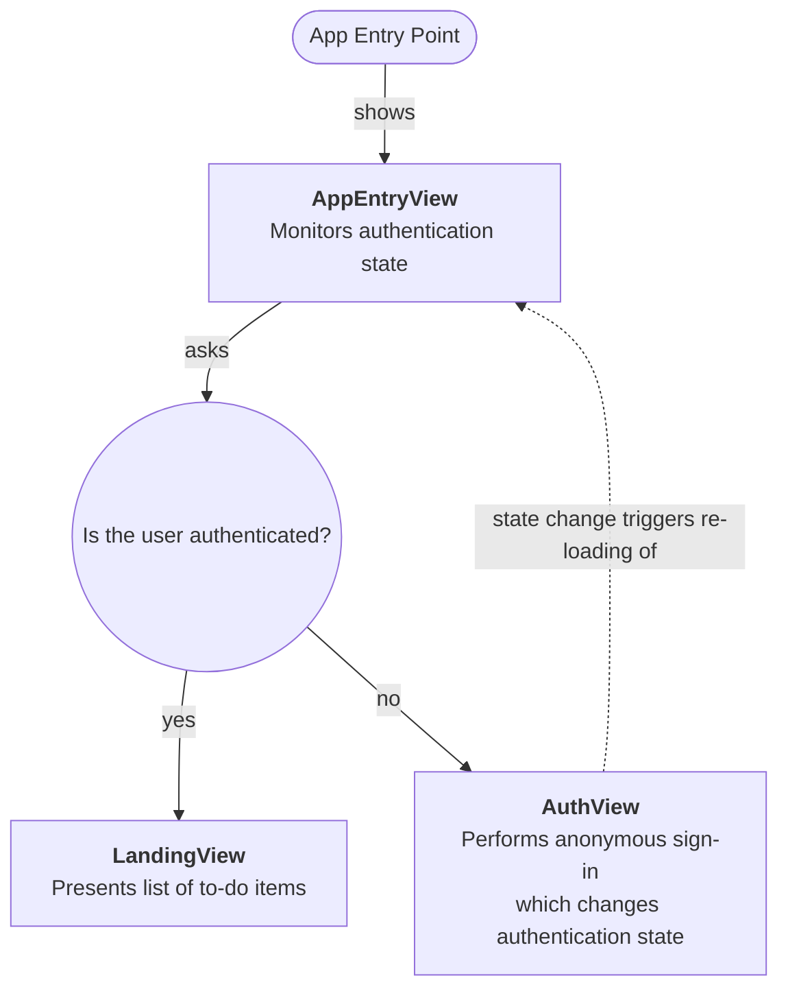

In [[To-do List App, Pt. 6|part six]] of this task, you learned how to implement all the functionality required to create, read, update, and delete data from a database hosted at Supabase. That knowledge will be directly applicable to the app you build for your culminating task.

In this continuation of that tutorial, you will learn how to make search work within the to-do app and how to correct a critical security flaw with the current configuration of your Supabase project.

## Search data in the cloud

As the list of to-do items stored by a user grows, it would be ideal to be able to filter, or search, the list of items.

At present, search does not work:

![[RocketSim_Recording_iPhone_15_Pro_6.1_2024-05-22_19.42.07.gif|351]]

Using raw SQL, to search, or filter, the list of to-do items, you would run a query like this:

```sql
SELECT *
FROM todos
WHERE title LIKE '%nap%'
```

If you like, try this out directly on your database hosted at Supabase.

From the Supabase website, select the **SQL Editor** icon:

![[Screenshot 2024-05-19 at 3.42.00 PM.png]]

You will come to a page that looks like this:

![[Screenshot 2024-05-19 at 3.45.38 PM.png]]

Try running a `SELECT` statement like the one above directly on the `todos` table in your database. Notice how the list of rows returned is reduced based on what you provide between the `%` signs.

Now try running a query like this:

```sql
SELECT *
FROM todos
```

Notice how all the rows of the `todos` table are returned.

### Adjust the view model

The first step using the Supabase framework to search, or filter, to-do list items within your app is to add another function to the view model.

Switch to the `TodoListViewModel` file and fold up the existing functions so that they look like this:

![[Screenshot 2024-05-22 at 7.46.15 PM.png]]

Now, copy and paste the code below to add a new function at the end of the list of existing functions – be sure the new function goes inside the `TodoListViewModel` class – that is, before the closing `}` bracket:

```swift
func filterTodos(on searchTerm: String) async throws {

	if searchTerm.isEmpty {

		// Get all the to-dos
		Task {
			try await getTodos()
		}

	} else {

		// Get a filtered list of to-dos
		do {
			let results: [TodoItem] = try await supabase
				.from("todos")
				.select()
				.ilike("title", pattern: "%\(searchTerm)%")
				.order("id", ascending: true)
				.execute()
				.value

			self.todos = results

		} catch {
			debugPrint(error)
		}

	}

}
```

... like this:

![[Screenshot 2024-05-22 at 7.49.59 PM.png]]

Let's break that function down a bit.

> [!Discussion]
> 
> 1. The `filterTodos` function accepts a single argument of type `String`, with an external parameter name of `on`. Whatever data is passed in to the parameter will be accessible inside the function using the internal parameter name of `searchTerm`.
>    &nbsp;
> 2. When the provided search term is empty, the complete list of to-do items is fetched from the cloud-hosted database.
>    &nbsp;
> 3. When the provided search term is not empty, we invoke a series of function calls to run a select statement with a `WHERE` clause, limiting results to rows where data in the `title` column contains whatever was provided in the search term. We then assign these results to the `todos` array. Since the view model is marked with `@Observable`, when the contents of the `todos` array are changed, the user interface of our app will be updated.
>    
>    Note that the `ilike` function is a case insensitive search. That means a search term of `For` would match a to-do item with a title of `Go for a run`.
>    
>    If you use the `like` function in the same way, results are case sensitive. In that case, a search term of `For` would *not* match a to-do item with a title of `Go for a run`.

Before continuing with this tutorial, it is worth briefly reviewing, and then bookmarking [this section of the Supabase documentation](https://supabase.com/docs/reference/javascript/using-filters). It is quite likely you will need to query and filter data that exists in your database while authoring your culminating task app – so, this documentation will be a helpful reference.

### Adjust the view

Now that we have a new function in the view model that finds to-do items whose title contains a provided search term, we must modify the view so that it makes use of this new function. 

Remember that in general, this is how the MVVM (model, view, view model) design pattern works:



In our view, at present, it is the `.searchable` view modifier:

![[Screenshot 2024-05-22 at 8.03.40 PM.png]]

... attached to the `List` structure that adds the search field to our user interface:

![[RocketSim_Screenshot_iPhone_15_Pro_6.1_2024-05-22_20.04.14.png|351]]

The search field has a binding to the `searchText` stored property. So, whenever the user types something into the search field, the contents of `searchText` will be updated.

We need to make our app react to changes in the `searchText` stored property.

To do this, copy the following code and then add it below the `.searchable` view modifier:

```swift
.onChange(of: searchText) {
	Task {
		try await viewModel.filterTodos(on: searchText)
	}
}
```

...like this:

![[Screenshot 2024-05-22 at 8.08.20 PM.png]]

If needed, press **Command-`A`** and then **Control-`I`** to re-indent your code and keep it tidy.

Now, whenever the value of the `searchText` stored property changes, a task – a block of asynchronous work – will be started. This block of code invokes the `filterTodos` function that we just added to the view model, passing in `searchText` as the argument for the `on` parameter.

As described earlier, that will cause the `todos` array to be refreshed and limited to rows in the `todos` table in our database whose `title` column data contains the provided search text.

Try this out in your app now. You should see something like the following:

![[RocketSim_Recording_iPhone_15_Pro_6.1_2024-05-22_20.10.48.gif|350]]

This is important progress, so please be sure to commit and push your work at this point with the following message:

```
Added the ability to search and filter the list of to-do items.
```

## A significant security problem

To keep things simple when we started to use Supabase, we initially [[To-do List App, Pt. 5#Create a table|disabled row-level security]] on the `todos` table.

What does that mean, though?

To understand this, try running your app on a different device in the Simulator, or, watch and consider the short video below.

Each Simulator device is equivalent to a different physical device.

So if you try out your app on an iPhone 15 Pro in the Simulator, and then you also try out your app on an iPhone 15 in the Simulator, this is like running your app on two different physical devices. 

Let's see what this looks like as a video:

<figure style="width: 640px;">
	<video width="640" controls preload="metadata">
	  <source src="https://www.russellgordon.ca/lcs/2023-24/ics3u/no-row-level-security.mp4" type="video/mp4">
	Your browser does not support the video tag.
	</video>
</figure>

Do you see the problem? Imagine that those two phones have different owners. It is not correct for one person to be seeing another person's to-do items!

### Enable row-level security

To fix this problem, we will enable row-level security on the `todos` table using the Supabase website.

Then, we will adjust our app so that it authenticates with Supabase, allowing it to make changes to the `todos` table even while row-level security is enabled.

First, visit your [Supabase dashboard](https://supabase.com/dashboard/):

![[Screenshot 2024-05-22 at 9.04.20 PM.png]]

Select your to-do list app project, and you will see something like the following:

![[Screenshot 2024-05-22 at 9.04.54 PM.png]]

At left, select the **Table Editor** icon:

![[Screenshot 2024-05-22 at 9.05.24 PM.png]]

Then select the `todos` table:

![[Screenshot 2024-05-22 at 9.06.07 PM.png]]

Now select the **RLS disabled** button:

![[Screenshot 2024-05-22 at 9.06.34 PM.png]]

You will see the following message – go ahead and select the **Enable RLS for this table** button:

![[Screenshot 2024-05-22 at 9.08.14 PM.png]]

On the dialog that appears, go ahead and select the **Enable RLS** button:

![[Screenshot 2024-05-22 at 9.08.45 PM.png]]

### Add a column to identify the user

Next we must configure our project to automatically generate a universally unique identifier for each user of the app.

The user of our app will not know this is happening. As such, identifying the user to Supabase in this way is known as an *anonymous sign-in*. 

This identifier, or UUID, is used to define a *session* when interacting with Supabase. By default, a session created from an anonymous sign-in lasts indefinitely – that is, forever.

We need to add a column to the `todos` table to keep track of this unique identifier, or user id.

To do this, select the three dots beside the `todos` table entry at left:

![[Screenshot 2024-05-22 at 9.29.01 PM.png]]

Then select the **Edit Table** option:

![[Screenshot 2024-05-22 at 9.29.39 PM.png]]

Scroll down and at the bottom, select the **Add Column** button:

![[Screenshot 2024-05-22 at 9.30.17 PM.png]]

As shown below:

1. name the column `user_id`
2.  for the data type, scroll down in the menu provided and select `uuid`
3.  for the default value, select `auth.uid()`

Then go ahead and select the green **Save** button:

![[Screenshot 2024-05-22 at 9.33.40 PM.png]]

After a moment, you will briefly see a success message at top right:

![[Screenshot 2024-05-22 at 9.34.00 PM.png]]

Any existing rows will have the `user_id` set to `NULL` since those rows were created before the `user_id` column had been created.

### Define an RLS policy

There are a variety of ways row-level security (RLS) can be configured.

We now need to make that decision by defining an RLS policy.

Go ahead and select the **Add RLS policy** button:

![[Screenshot 2024-05-22 at 9.35.12 PM.png]]

On the next screen that appears, select the **Create policy** button:

![[Screenshot 2024-05-22 at 9.11.44 PM.png]]

You will then see this screen:

![[Screenshot 2024-05-22 at 9.16.06 PM.png]]

Choose the template for `INSERT` at right by clicking on it, and your screen will change to the following:

![[Screenshot 2024-05-22 at 9.16.54 PM.png]]

Next, make the following changes:

- In the **Policy Command** section, select `ALL`
- In the **Policy Name** field, change the title to `Enable access for users based on user_id`

... like this:

![[Screenshot 2024-05-22 at 9.18.42 PM.png]]

Finally, copy the text below:

```
(auth.uid() = user_id)
```

...and paste it on line 7 in the policy code block, like this:

![[Screenshot 2024-05-22 at 9.24.04 PM.png]]

Then press the green **Save policy** button.

When you return to the **Policies** screen you will see the following:

![[Screenshot 2024-05-22 at 9.36.22 PM.png]]

### Add authentication code to the app

The next step is to add code to our app to sign-in users anonymously, so that they can interact with the database.

Here is the approach our app will now take:



That's the theory. How does that work in practice?

> [!DISCUSSION]
> 
> Let's say a user has never opened our app before. 
> 
> The app opens to `AppEntryView`. A selection statement in `AppEntryView` identifies the current authentication state – the user is not authenticated. 
> 
> As a result `AuthView` is loaded. `AuthView` communicates with Supabase, signing the user in anonymously and creating a session with Supabase that will last indefinitely (forever). The authentication state changes to *signed in*.
> 
> Since the authentication state changed, `AppEntryView` is re-loaded. This time the user is authenticated because a session with the Supabase service was just created by `AuthView`. As a result `LandingView` is shown.

You can use this very same approach in your own app for the culminating task if you need a cloud-hosted database but do not need to know who is using your app.

Inside the **Views** group in your project, create a new file named `AppEntryView`, like this:

![[Screenshot 2024-05-23 at 5.58.34 AM.png]]

Then copy this code into your clipboard:

```swift
import SwiftUI

struct AppEntryView: View {
    
    // MARK: Stored properties
    
    // Keeps track of whether the user has been authenticated
    @State var isAuthenticated = false
    
    // MARK: Computed properties
    var body: some View {
        Group {
            
            // Directs to appropriate view based on whether
            // user is authenticated or not
            if isAuthenticated {
                
                // User is authenticated – show main view of our app
                LandingView()
            } else {
                
                // User not authenticated
                AuthView()
            }
        }
        .task {
            
            // Monitor authentication state
            for await state in await supabase.auth.authStateChanges {
                
                // If the user has been signed in, signed out, or if this is their
                // initial session with Supabase, the code block below will run
                if [.initialSession, .signedIn, .signedOut].contains(state.event) {
                    
                    // isAuthenticated set to true when the user has a session
                    // Otherwise, it is set to false
                    isAuthenticated = state.session != nil
                }
            }
        }
    }
}

#Preview {
    AppEntryView()
}
```

... and paste it into the new file, like this:

![[Screenshot 2024-05-23 at 6.00.45 AM.png]]

After adding that new code, you will see one error from the Swift compiler, noting that `AuthView` does not exist.

We will correct that situation now. Create a new file named `AuthView` inside the **Views** group, like this:

![[Screenshot 2024-05-23 at 6.04.03 AM.png]]

> [!NOTE]
> 
> When you paste in the code below, take a moment to skim the comments. 
> 
> Do not worry about memorizing any of this!
> 
> You can use this code verbatim in your own projects.

Now copy the following code into your clipboard:

```swift
import Supabase
import SwiftUI

struct AuthView: View {

    // Keeps track of what happened when we tried to authenticate with Supabase
    @State var result: Result<Void, Error>?
    
    var body: some View {
        
        VStack {
            
            // Show a "spinner" indicator while authentication occurs
            ProgressView()

            // Based on what happened during authentication, show an appropriate
            // message
            // NOTE: Unlikely this will ever be seen by the user, since a successful
            //       anonymous sign-in will trigger AppEntryView to reload and direct
            //       us to the main view of our app
            if let result {
                switch result {
                case .success:
                    Text("Ready!")
                case .failure(let error):
                    Text(error.localizedDescription).foregroundStyle(.red)
                }
            }
            
        }
        .task {
            do {
                
                // Try to restore an existing session rather than create a new one
                let _ = try await supabase.auth.user()
                result = .success(())
                
                // NOTE: It's important to restore an existing session if it exists,
                //       so that we can see data we previously created.
                //
                // NOTE: Sessions last indefinitely by default.
                // https://supabase.com/docs/guides/auth/sessions
                
            } catch AuthError.sessionNotFound {
                
                // No session was found when we tried to restore a session.
                // So, we need to sign in anonymously for the first time.
                do {
                    
                    try await supabase.auth.signInAnonymously()
                    
                } catch {
                    
                    // Report any error encountered when signing in
                    result = .failure(error)
                    
                }
                
            } catch {
                
                // Report any error encountered when trying to find an existing session
                result = .failure(error)
                
            }
        }
    }
    
}

#Preview {
    AuthView()
}
```

... and paste it into your new `AuthView` file, like this:

![[Screenshot 2024-05-23 at 6.11.55 AM.png]]

The final step is to adjust the app entry point file, so that it opens `AppEntryView` (see the flowchart included earlier).

Make this edit to the `TodoListApp` file:

![[Screenshot 2024-05-23 at 6.13.17 AM.png]]

Specifically, we previously opened `LandingView` directly from the app entry point.

Instead, we now open `AppEntryView`, which kicks off the logic described in the flowchart earlier.

Now you can test your app:

![[Screenshot 2024-05-23 at 6.16.40 AM.png]]

When you run your app, you will see this message:

![[RocketSim_Screenshot_iPhone_15_Pro_6.1_2024-05-23_06.19.59.png|350]]

By default, Supabase projects have anonymous sign-ins disabled. This is by design, for security purposes.

### Enable anonymous sign-ins

Anonymous sign-ins to Supabase are easily enabled.

Visit [your Supabase dashboard](https://supabase.com/dashboard/), then select your project:

![[Screenshot 2024-05-23 at 6.23.23 AM.png]]

At left, select the **Project Settings** link:

![[Screenshot 2024-05-23 at 6.26.18 AM.png]]

You will see a page like this – select the **Authentication** link:

![[Screenshot 2024-05-23 at 6.27.26 AM.png]]

You will see the **Auth Settings** page:

![[Screenshot 2024-05-23 at 6.28.25 AM.png]]

From this page, flip the switch so that anonymous sign-ins are allowed for your project:

![[Screenshot 2024-05-23 at 6.29.07 AM.png]]

Scroll down on that page, and select the **Save** button to ensure your authentication settings change takes effect:

![[Screenshot 2024-05-23 at 6.33.11 AM.png]]

After a moment you should briefly see a success message:

![[Screenshot 2024-05-23 at 6.33.45 AM.png]]

Now build your application again:

![[Screenshot 2024-05-23 at 6.31.36 AM.png]]

When the app opens, you will see an empty list of to-do items:

![[RocketSim_Screenshot_iPhone_15_Pro_6.1_2024-05-23_06.35.11.png|350]]

This expected, because we have just enabled row-level security and anonymous sign-ins.

No user of your app will be able to see the to-do items of another user, even though everyone's to-do items are stored in the same `todos` table of your database.

So, how does that work? Let's take a brief look to complete this part of the tutorial.

First, though – be sure to commit and push your changes with this message:

```
Added an authentication flow so that users are signed-in anonymously and assigned a unique user id. This prevents one user from seeing another user's data.
```

### Understanding Supabase authentication

Let's see how the changes we've just made impact what happens when we use two different devices.

With your app running in the Simulator, add a few different to-do items, like this:

![[RocketSim_Recording_iPhone_15_Pro_6.1_2024-05-23_06.39.26.gif|350]]

Now return to [your Supabase dashboard](https://supabase.com/dashboard/) and select your project:

![[Screenshot 2024-05-23 at 6.41.33 AM.png]]

Then open the table editor:

![[Screenshot 2024-05-23 at 6.42.07 AM.png]]

Then open the `todos` table:

![[Screenshot 2024-05-23 at 6.42.58 AM.png]]

You will see the to-do items just created, as well as (probably) some to-do items that you created before authentication was turned on:

![[Screenshot 2024-05-23 at 6.43.22 AM.png]]

Notice that the new to-do items have a UUID value placed in the `todos` table within the `user_id` column. That information is added automatically for us by Supabase.

Now try running your app in a second device within the Simulator, as shown in this short video:

<figure style="width: 640px;">
	<video width="640" controls preload="metadata">
	  <source src="https://www.russellgordon.ca/lcs/2023-24/ics3u/row-level-security-enabled.mp4" type="video/mp4">
	Your browser does not support the video tag.
	</video>
</figure>

Notice how to-do items between the two devices are now separate – items added on one device are not seen on the other device. 🎉

If you go back to the `todos` table at Supabase – notice the new to-do items have been added, but under a different UUID:

![[Screenshot 2024-05-23 at 6.53.09 AM.png]]

Each device that uses your app will be assigned a different unique user id – once again – different users will not see each other's data.

What's really nice about the Supabase framework is that – outside of having to add an authentication flow (sign-in logic) to our app – we *did not have to change any other code*.

Remember, when the `getTodos` function in the view model is run:

![[Screenshot 2024-05-23 at 6.55.14 AM.png]]

... that is essentially this SQL command:

```sql
SELECT *
FROM todos
```

However, in our app, the user only sees their own to-do items!

How does that work? Behind the scenes, Supabase is silently adding this `WHERE` clause to every query we run:

```sql
SELECT *
FROM todos
WHERE user_id = auth.uid
```

That is saying:

	"Get all the rows from the 'todos' table, but only those rows where the user id matches the user id of the authenticated user."

Pat yourself on the back – no really, do it!

Authentication within an app can be a tricky topic to wrap your head around.

Fortunately, Supabase makes it pretty easy to do.

If you have further questions, please, be sure to ask Mr. Gordon!

### Addendum

If you see this warning, you can ignore it:

![[Screenshot 2024-05-23 at 6.58.48 AM.png]]

That is the Swift compiler saying, essentially – "You don't need to use `await` here because there are no asynchronous tasks happening."

However, if you hold the **Option** key down and click the `authStateChanges` function you can see the documentation clearly identifies the function as being asynchronous:

![[Screenshot 2024-05-23 at 6.59.08 AM.png]]

So far as Mr. Gordon can tell – this warning should not be showing up. It will probably go away in a future version of Xcode when this same code is run.

Is it a bit annoying that the compiler shows a warning when it shouldn't? Yes, it certainly is. However, this is part of life as a software developer.
