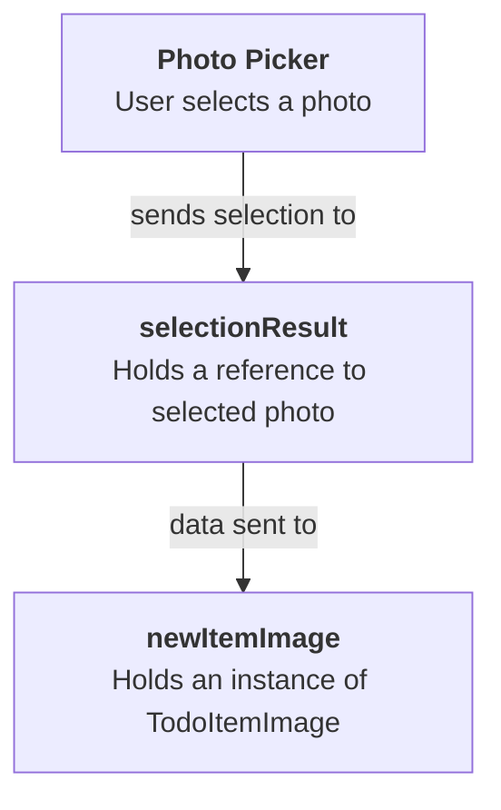

---
---
In [[To-do List App, Pt. 8|part eight]] of this task, you improved the user interface of the app in these ways:

- cleared the input field after a to-do item was added
- disabled the **Add** button, until the user types valid input for a to-do item
- used a sheet to show the user interface for adding a new to-do item
- provided a cue to users to add new items, when none exist

In today's optional continuation of that tutorial, you will learn how to attach images to a to-do item.

Here is a 90-second video showing how the revised app will function when you have completed today's tutorial:

<figure style="width: 350px;">
	<video width="350" controls preload="metadata">
	  <source src="https://www.russellgordon.ca/lcs/2023-24/ics3u/todo-list-with-images.mp4" type="video/mp4">
	Your browser does not support the video tag.
	</video>
</figure>

## Extend the model

When a user imports a photo from the device's photo library, our app must have a data structure that can hold the photo's data in memory.

Later, we will write the photo, or image, to Supabase, where it will be persisted even if we close the to-do list app.

Find the **Model** group in your project, and add a new Swift file named `TodoItemImage.swift`:

![[Screenshot 2024-05-28 at 8.02.26 PM.png]]

Now copy the following code into your clipboard:

```swift
import SwiftUI

struct TodoItemImage: Transferable, Equatable {
    
    // MARK: Stored properties
    let image: Image
    let data: Data
    
    // MARK: Computed properties
    
    // Required to conform to Transferable protocol
    // Is invoked when user picks (attempts to import) an image from photo library into this app
    static var transferRepresentation: some TransferRepresentation {
        
        return DataRepresentation(importedContentType: .image) { importedImageData in
            
            // Attempt to create an instance of TodoItemImage from the imported data
            guard let image = TodoItemImage(rawImageData: importedImageData) else {
                // If the important did not work, throw an error
                throw TransferError.importFailed
            }
            
            // The import worked, so return the imported image
            return image
        }
    }
}

// Extend the structure to add new capabilities
extension TodoItemImage {
    
    // MARK: Initializer(s)
    
    // An initializer to create an instance of TodoItemImage from the image data
    // returned by the PhotosPicker
    init?(rawImageData: Data) {
        
        // Create an instance of UIImage from the raw image data provided
        guard let uiImage = UIImage(data: rawImageData) else {
            return nil
        }
        
        // Create a SwiftUI Image structure from the UIImage instance
        let image = Image(uiImage: uiImage)
        
        // Initialize and return TodoImage instance
        self.init(image: image, data: rawImageData)
    }
    
}

// List the possible errors that can occur when importing an image
enum TransferError: Error {
    case importFailed
}
```

... and paste it into the new file in your project, like this:

![[Screenshot 2024-05-28 at 8.04.06 PM.png]]

Let's examine what is happening in this code, but at a high level first. We will look at details in a moment.

![[Screenshot 2024-05-28 at 8.06.16 PM.png]]

At a high level, we have:

> [!DISCUSSION]
> 
> 1. A new structure named `TodoItemImage` is defined. It's purpose is to hold an image that goes along with a given `TodoItem`.
>    
> 2. The structure conforms to the `Transferable`  protocol, which is a must to allow for importing from the device's photo library. More on this in a moment.
>    
> 3. Separately the definition of the `TodoItemImage` structure is extended to add new functionality. More on this in a moment.
>    
> 4. An enumeration named `TransferError` is defined. An enumeration is a way of defining a data type with only certain defined states. You can think of a Boolean as an enumeration of sorts – a Boolean, or `Bool` in Swift, can only contain `true` or `false`. The purpose of the `TransferError` enumeration is to define all the possible error states that can occur when importing an image from the device's photo library.

Let's look in more detail at the implementation of `TodoItemImage` now:

![[Screenshot 2024-05-28 at 8.11.46 PM.png]]

In this structure:

> [!DISCUSSION]
> 
> 1. `TodoItemImage` has two stored properties. The first, `image`, holds an actual instance of the `Image` data type used by SwiftUI. This will display the image in the user interface. The second stored property, `data`, holds the raw stream of data – the literal 1's and 0's – that make up the imported image.
>    
> 2. On line 20, a computed property named `transferRepresentation` is defined. This is required to conform to the `Transferable` protocol. The user will select a photo whose data is copied, or transferred, out of the photo library and into our app. The job of this computed property is to attempt to take that data and create an instance of the `TodoItemImage` structure from it.
>    
> 3. At this point, we try to create an instance of the `TodoItemImage` structure. If this does not work, an error is thrown, indicating that the import of the image from the photo library did not work.
>    
> 4. If the import works, an instance of `TodoItemImage`  is returned.

Let's look at the enumeration next:

![[Screenshot 2024-05-28 at 8.21.34 PM.png]]

In the enumeration:

> [!DISCUSSION]
> 
> 1. There is only one possible error condition that can occur when transferring image data out of a device's photo library – a failure of the entire import procedure. As such, there is just one possible state, or case, for the `TransferError` enumeration.

Finally, let's examine the extension:

![[Screenshot 2024-05-28 at 8.26.31 PM.png]]

In the extension:

> [!DISCUSSION]
> 
> 1. The extension adds a custom initializer to the `TodoItemImage` structure. Recall that the job of an initializer in a structure or class is to get the instance of that structure or class ready for use.
>    
> 2. It is not possible (currently) to create a SwiftUI `Image` structure directly from a raw stream of 1's and 0's that represent an image. Instead, we must first create an instance of the `UIImage` data type. This is provided through the UIKit framework, which is another (older) framework that can be used to create user interfaces for iOS. UIKit is a bit harder to use than SwiftUI, but it is more customizable in terms of what kind of interfaces can be created. If an instance of the `UIImage` data type cannot be created for some reason, a `nil` value is returned.
>    
> 3. If we got this far, we take the instance of the `UIImage` data type and create from it an instance of the SwiftUI `Image` structure.
>    
> 4. An instance of `TodoItemImage` is returned.

**Bottom line** – if you need to import images into your app from a device's photo library, you need to use code just like this. The only thing that might change is the name of the structure. In this app, we named the data type `TodoItemImage`. In your app, you might choose a name for the structure that better matches what you are doing in your app. For example, if you are building an online marketplace app where people post listings of items for sale, you might name this structure `ListingImage` instead.

This is a key step, even though we've just created a single file. Please commit and push your work with this message:

```
Added a new data structure to represent an image that was picked (selected) from the photo library of the device.
```

## Add the photo picker

Our next step is to add the ability to select an image from the user's photo library, and then show that image in the user interface where a new to-do item is added.

Switch to `NewItemView` – recall that this is the view that appears in the slide-up sheet, when we are adding a new to-do item:

![[Screenshot 2024-05-28 at 8.46.03 PM.png]]

### Import the framework

First, we must import a new framework – PhotosUI – please add this line of code:

```swift
import PhotosUI
```

...above the `import SwiftUI` line of code:

![[Screenshot 2024-05-28 at 8.47.31 PM.png]]

### Add the stored properties

Next we need to add two stored properties:

```swift
// The selection made in the PhotosPicker
@State var selectionResult: PhotosPickerItem?

// The actual image loaded from the selection that was made
@State var newItemImage: TodoItemImage?
```

... like this:

![[Screenshot 2024-05-28 at 8.48.37 PM.png]]

The first stored property, `selectionResult`, holds a reference to whatever item was selected by the user in the picker. This could be a video, an image, or potentially something else. In our case, we will limit what can be selected to an image.

The second stored property, `newItemImage`, will contain an actual instance of the data type we defined in the [[To-do List App, Pt. 9#Extend the model|prior section of this tutorial]].

### Add the function

Next, use code-folding to fold up the `body` property of the view, like this:

![[Screenshot 2024-05-28 at 8.50.59 PM.png]]

Now add a few blank lines below the `body` property, taking care to ensure you are doing this inside the closing `}` of the `NewItemView` structure:

![[Screenshot 2024-05-28 at 8.52.06 PM.png]]

Take the following code:

```swift
// MARK: Functions

// Transfer the data from the PhotosPicker selection result into the stored property that
// will hold the actual image for the new to-do item
private func loadTransferable(from imageSelection: PhotosPickerItem) {
	Task {
		do {
			// Attempt to set the stored property that holds the image data
			newItemImage = try await imageSelection.loadTransferable(type: TodoItemImage.self)
		} catch {
			debugPrint(error)
		}
	}
}
```

... and copy it into your computer's clipboard, then paste it into the space you just created in `NewItemView`, like this:

![[Screenshot 2024-05-28 at 8.53.18 PM.png]]

The purpose of this function is described in the comments associated with it.

Essentially, it's job is to take the picker selection the user makes, and transfer the image data into an instance of the `TodoItemImage` data type. Via the `Transferable` protocol, this function will invoke the `transferRepresentation` computed property that we defined earlier in `TodoItemImage`. 

### Detect photo selections

Next, we must detect when the user has made a selection in the photo picker.

Unfold the `body` property in `NewItemView`:

![[Screenshot 2024-05-28 at 8.58.17 PM.png]]

Then, fold up the `VStack`:

![[Screenshot 2024-05-28 at 8.59.26 PM.png]]

Next add a few blank lines below the `.toolbar` view modifier:

![[Screenshot 2024-05-28 at 8.59.53 PM.png]]

Then copy this code into your clipboard:

```swift
// This block of code is invoked whenever the selection from the picker changes
.onChange(of: selectionResult) {
	// When the selection result is not nil...
	if let imageSelection = selectionResult {
		// ... transfer the data from the selection result into
		// an actual instance of TodoItemImage
		loadTransferable(from: imageSelection)
	}
}
```

... and paste it after the `.toolbar` view modifier, like this:

![[Screenshot 2024-05-28 at 9.01.51 PM.png]]

If needed, press **Command-`A`** and then **Control-`I`** to re-indent your code and keep it tidy.

That new code will be invoked whenever a new photo is selected in the picker. 

Here is the overall sequence of what happens:

This is what happens, in general:



### Present the picker interface

Finally, scroll up to the `VStack` that was folded up earlier:

![[Screenshot 2024-05-28 at 9.12.49 PM.png]]

Unfold it:

![[Screenshot 2024-05-28 at 9.13.08 PM.png]]

Highlight the `Spacer` that is inside the `VStack`:

![[Screenshot 2024-05-28 at 9.13.40 PM.png]]

Now copy this code into your clipboard:

```swift
HStack {
	
	PhotosPicker(selection: $selectionResult, matching: .images) {
		
		// Has an image been loaded?
		if let newItemImage = newItemImage {
			
			// Yes, show it
			newItemImage.image
				.resizable()
				.scaledToFit()

		} else {
			
			// No, show an icon instead
			Image(systemName: "photo.badge.plus")
				.symbolRenderingMode(.multicolor)
				.font(.system(size: 30))
				.foregroundStyle(.tint)
			
		}
	}

}
.frame(height: 100)
```

... and paste it into the file, replacing the `Spacer`, like this:

![[Screenshot 2024-05-28 at 9.14.50 PM.png]]

Let's examine that code more carefully:

![[Screenshot 2024-05-28 at 9.16.44 PM.png]]

In order:

> [!DISCUSSION]
> 
> 1. The `PhotosPicker` structure is provided by the `PhotosUI` framework and makes it possible to select photos from the device's photo library.
>    
> 2. The picker is bound to the `selectionResult` stored property that we added and discussed earlier. When a selection is made in the picker, this stored property is updated to hold the selection that was made.
>    
> 3. We configure the `PhotosPicker`  to allow selection of images only. However, many different types of items can be selected from a device's photo library:
>    ![[Screenshot 2024-05-28 at 9.20.29 PM.png|300]]
>    
> 4. Inside the block of code tied to the `PhotosPicker` we provide the user interface element that the user can click on to bring up the picker interface.
>    
>    If an image has been selected, this will be a thumbnail of that image.
>    
>    If an image has not yet been selected, this will be an appropriate SF Symbol.

Finally, switch over to the `LandingView` file in your project, and scroll down to the code that presents the sheet that will show `NewItemView`:

![[Screenshot 2024-05-28 at 9.26.03 PM.png]]

The addition of the photos picker means that the sheet will need to be a little larger to show the expanded user interface. So, please change the fraction of the screen size that the sheet will take up – increasing it from 15%:

```swift
.presentationDetents([.fraction(0.15)])
```

... to 25% instead:

```swift
.presentationDetents([.fraction(0.25)])
```

We've done enough to be able to try out the photos picker at this point. 

Run the app in the Simulator on your computer, or on a device attached to your computer, and try this out:

![[RocketSim_Recording_iPhone_15_Pro_6.1_2024-05-28_21.28.05.gif|350]]

You may have noticed a couple of issues:

1. After adding a new to-do item, the text field is cleared, but the selected photo remains.
2. The to-do item is added, but not the image that goes along with it.

We can fix the first issue quickly. We will address the second issue in the next section of today's tutorial.

To fix the first issue, switch to `NewItemView`  and scroll down to the code that defines the **Add** button:

![[Screenshot 2024-05-28 at 9.30.58 PM.png]]

Find the code that clears the text field:

```swift
// Clear the input field
newItemDescription = ""
```

... and add this code below it:

```swift
// Clear the photo picker selection result
selectionResult = nil
// Clear the loaded photo
newItemImage = nil
```

... like this:

![[Screenshot 2024-05-28 at 9.32.14 PM.png]]

Now run the app again, and try adding a to-do item that contains an image:

![[RocketSim_Recording_iPhone_15_Pro_6.1_2024-05-28_21.34.17.gif|350]]

Note that the selected image is now cleared after the new to-do item is added.

This is all very important progress, so please commit and push your work now with this message:

```
Can now select and load a photo from the Photos library.
```

## Configure Supabase to store photos

Now we need to complete a bit of setup in the cloud at Supabase to be able to save the photos that have been selected by users in the to-do list app.

### Adjust the database table

Visit your [Supabase dashboard](https://supabase.com/dashboard/projects):

![[Screenshot 2024-05-29 at 5.41.51 AM.png]]

Then select your **Todo List App** project:

![[Screenshot 2024-05-29 at 5.42.12 AM.png]]

Open the **Table Editor**:

![[Screenshot 2024-05-29 at 5.42.23 AM.png]]

Select the `todos` table:

![[Screenshot 2024-05-29 at 5.42.40 AM.png]]

Click the three dots beside the `todos` table and select **Edit Table**:

![[Screenshot 2024-05-29 at 5.44.47 AM.png]]

Select the **Add Column** button:

![[Screenshot 2024-05-29 at 5.45.06 AM.png]]

Create a new column named `image_url` with a data type of `text` and a default value of `NULL`, then press the green **Save** button:

![[Screenshot 2024-05-29 at 5.46.41 AM.png]]

You should see some messages indicating the column was created, and then something like the following – notice the addition of the `image_url` column at right:

![[Screenshot 2024-05-29 at 5.47.35 AM.png]]

This column will contain the *filename* of the image for a to-do item, when an image is uploaded.

### Add a storage bucket

Databases are great at storing, searching, and sorting *text* – they perform less well when managing large binary objects – that is, a lot of 1's and 0's that represent things like images.

In most cases then, application developers do not store images directly in a database.

Instead, they store a *pointer* to the image, and the image is saved somewhere else.

That is what we will do. We store a pointer – the filename – for an image in the database – and we will set up a storage bucket – essentially a folder – to hold all of the uploaded images.

So, please select the **Storage** option at left in Supabase:

![[Screenshot 2024-05-29 at 5.51.06 AM.png]]

Then select the **New bucket** button:

![[Screenshot 2024-05-29 at 5.53.22 AM.png]]

In the dialog that appears, provide the name `todos_images`, ensure that the bucket is *not* public, and then select the **Save** button:

![[Screenshot 2024-05-29 at 5.54.25 AM.png]]

You should then see the following:

![[Screenshot 2024-05-29 at 5.55.53 AM.png]]

Now under the **Configuration** section at left, select **Policies**:

![[Screenshot 2024-05-29 at 5.57.19 AM.png]]

Then in the section for the `todos_images` storage bucket, select the **New policy** button:

![[Screenshot 2024-05-29 at 5.58.08 AM.png]]

In the dialog that appears, select the **For full customization** option:

![[Screenshot 2024-05-29 at 5.59.01 AM.png]]

Make the following inputs:

- In **Policy name** type `Authenticated users can select, insert, and delete`.
- In **Allowed operation**, enable `SELECT`, `INSERT`, and `DELETE`.
- In **Target roles** select `authenticated`.

Like this:

![[Screenshot 2024-05-29 at 6.02.16 AM.png]]

Then press the **Review** button:

![[Screenshot 2024-05-29 at 6.02.16 AM copy 1 1.jpg]]

You will see a dialog like this – go ahead and select the **Save policy** button:

![[Screenshot 2024-05-29 at 6.05.05 AM.png]]

Finally, you should see the newly created policies listed:

![[Screenshot 2024-05-29 at 6.06.24 AM.png]]

### Adjust the model

Return to the Table Editor:

![[Screenshot 2024-05-29 at 6.08.03 AM.png]]

Then select the `todos` table:

![[Screenshot 2024-05-29 at 6.08.34 AM.png]]

Notice that we named new column to hold image filenames `image_url`.

This capitalization strategy is referred to as `snake_case`, and it is the convention used by most developers when building a database.

In Swift, the convention (as you know) is to use the `camelCase` capitalization strategy.

So, we need to make a minor edit to the `TodoItem` structure in our project in Xcode to manage this.

Switch to Xcode and open the `TodoItem` file:

![[Screenshot 2024-05-29 at 6.10.47 AM.png]]

Add some blank lines after the stored properties of the structure:

![[Screenshot 2024-05-29 at 6.11.26 AM.png]]

Now copy this code into your computer's clipboard:

```swift
var imageURL: String?

// When decoding and encoding from JSON, translate snake_case
// column names into camelCase
enum CodingKeys: String, CodingKey {
	case id
	case title
	case done
	case imageURL = "image_url"
}
```

... and paste it into the `TodoItem` structure, below the existing stored properties, like this:

![[Screenshot 2024-05-29 at 6.12.47 AM.png]]

Note that we have added a fourth stored property, named `imageURL`. This matches up to the column [[To-do List App, Pt. 9#Adjust the database table|that we added a moment ago to the `todos` database table]].

The enumeration that is added will be used by Swift when Supabase decodes the information from JSON and turns it into instances of the `TodoItem` structure.

This line is key:

```swift
	case imageURL = "image_url"
```

This tells Swift to look for information from the `image_url` column in our table, but to make the data available inside our Swift app using the `imageURL` property. 

Please commit and push your work at this point with the following message:

```
Adjusted model for TodoItem to match new column in todos table for tracking image URL.
```

## Upload selected photos to database

Next we'll make a small series of edits to ensure that images are actually uploaded to Supabase when new to-do items are created.

### Adjust the view model

Since we are dealing with data, that means we will be editing the view model.

Please open `TodoListViewModel` now:

![[Screenshot 2024-05-29 at 6.18.45 AM.png]]

Since images will be written to the [[To-do List App, Pt. 9#Add a storage bucket|Supabase storage bucket we just created]], we must add the `Storage` framework to the view model.

Add this line of code:

```swift
import Storage
```

... after the existing `import` statement, like this:

![[Screenshot 2024-05-29 at 6.20.01 AM.png]]

Now scroll down to the `createToDo` function:

![[Screenshot 2024-05-29 at 6.20.17 AM.png]]

Currently the function accepts one parameter, whose external parameter name is `withTitle` and whose internal parameter name is `title` and whose data type is `String`.

We are going to add a second parameter that will accept an image that has been selected by the user.

Please make the following edit, changing the function definition from:

```swift
func createToDo(withTitle title: String) {
```

... to:

```swift
func createToDo(withTitle title: String, andImage providedImage: TodoItemImage?) {
```

... like this:

![[Screenshot 2024-05-29 at 6.24.08 AM.png]]

Now there are two parameters. The second parameter has an external name of `andImage`. The internal parameter name is `providedImage`. The data type is an optional `TodoItemImage`. When the user has selected an image to go along with a new to-do item, this parameter will be provided with an image, otherwise, it will receive `nil`.

Now find the start of the asynchronous task inside the function:

![[Screenshot 2024-05-29 at 6.24.40 AM.png]]

Below that line of code, add a few blank lines:

![[Screenshot 2024-05-29 at 6.25.23 AM.png]]

Then copy this code into your computer's clipboard:

```swift
// Upload an image.
// If one was not provided to this function, then this
// function call will return a nil value.
let imageURL = try await uploadImage(providedImage)
```

... and paste it into that area, like this:

![[Screenshot 2024-05-29 at 6.26.07 AM.png]]

The purpose of that code is to take the provided image (if one was given) and actually upload the image to Supabase. If the image was uploaded successfully, `imageURL` will contain the filename of the image as stored within the storage bucket on Supabase. If no image was provided, `imageURL` will be `nil`.

In a moment, you see an error message:

```
Cannot find 'uploadImage' in scope.
```

That just means we are trying to use a function – `uploadImage` – that does not yet exist within the view model.

We will fix that in a moment.

Scroll down a bit further and locate the section of code that creates a new `TodoItem` instance:

![[Screenshot 2024-05-29 at 6.27.11 AM.png]]

Adjust the code so that we provide the `imageURL` when creating the `TodoItem`:

![[Screenshot 2024-05-29 at 6.29.21 AM.png]]

Now we will add the `uploadImage` function.

Fold up the `createToDo` function:

![[Screenshot 2024-05-29 at 6.29.51 AM.png]]

Now copy this code into your computer's clipboard:

```swift
// We mark the function as "private" meaning it can only be invoked from inside
// the view model itself (it will not be accessible from the view layer)
private func uploadImage(_ image: TodoItemImage?) async throws -> String? {
	
	// Only continue past this point if an image was provided.
	// If an image was provided, obtain the raw image data.
	guard let imageData = image?.data else {
		return nil
	}
	
	// Generate a unique file path for the provided image
	let filePath = "\(UUID().uuidString).jpeg"
	
	// Attempt to upload the raw image data to the bucket at Supabase
	try await supabase.storage
		.from("todos_images")
		.upload(
			path: filePath,
			file: imageData,
			options: FileOptions(contentType: "image/jpeg")
		)
	
	return filePath
}
```

Paste the code below the `createToDo` function but above the `delete` function, like this:

![[Screenshot 2024-05-29 at 6.31.22 AM.png]]

You will notice the error message goes away.

Review the comments in that code to understand what it does to upload an image.

You can use this function verbatim in your culminating task. The only thing that would need to change in a different project is what storage bucket the image is uploaded to. In this project, we are using `todos_images` for the storage bucket name. In your project, you might select a different name for your storage bucket, so you would need to adjust this line of code (line 112 in the screenshot):

![[Screenshot 2024-05-29 at 6.32.56 AM.png]]

### Adjust the view

Switch to `NewItemView` and locate the line of code that invokes the `createToDo` function in the view model:

![[Screenshot 2024-05-29 at 6.34.43 AM.png]]

It may be marked with an error.

This is because we added a second parameter to pass in the image – but here in the view, we are not yet providing an argument for that second parameter.

So, please change this code:

```swift
viewModel.createToDo(withTitle: newItemDescription)
```

... to this instead:

```swift
viewModel.createToDo(withTitle: newItemDescription, andImage: newItemImage)
```

When creating a to-do item, we are now providing both the description of the new to-do item – the text – and potentially an image as well – if one was selected.

We can now try this new code out.

Please run your app in the Simulator, and create a new to-do item along with an image:

![[RocketSim_Recording_iPhone_15_Pro_6.1_2024-05-29_06.37.24.gif|350]]

We don't yet see the image in our to-do list (we'll fix that in the next section of this tutorial) but if we go to Supabase, we can see the uploaded image.

Switch to Supabase where you likely still have the `todos` table showing.

Notice that the new to-do item created in the animation above is now showing in Mr. Gordon's database table:

![[Screenshot 2024-05-29 at 6.39.52 AM.png]]

In particular, a value in the `image_url` column shows up.

Now switch to the Storage panel:

![[Screenshot 2024-05-29 at 6.40.59 AM.png]]

Then select the `todos_images` bucket:

![[Screenshot 2024-05-29 at 6.41.49 AM.png]]

Then select the file that was uploaded from your app:

![[Screenshot 2024-05-29 at 6.42.27 AM.png]]

You should see the image shown in a preview at right.

This is great progress – images are actually persisted in the cloud! 

Please commit and push your work with this message:

```
When a to-do item is added with an image, the image is now uploaded to Supabase.
```

## Download photos from the database

Next we need to show each image when there is one attached to a given to-do item in our list.

As you have likely come to expect at this point, that will involve first editing the view model, the editing a view to show the data.

Please switch to `TodoListViewModel` and fold up all of the functions:

![[Screenshot 2024-05-29 at 6.49.27 AM.png]]

We are going to add a new function named `downloadTodoItemImage` after `uploadImage` but before the `delete` function.

Please copy this code into your computer's clipboard:

```swift
func downloadTodoItemImage(fromPath path: String) async throws -> TodoItemImage? {
	
	// Attempt to download an image from the provided path
	do {
		let data = try await supabase
			.storage
			.from("todos_images")
			.download(path: path)
		
		return TodoItemImage(rawImageData: data)
		
	} catch {
		debugPrint(error)
	}
	
	// If we landed here, something went wrong, so return nil
	return nil
	
}
```

Then paste it into place, like this:

![[Screenshot 2024-05-29 at 6.51.01 AM.png]]

This function accepts a path – the image URL – and if it can find an image with the provided name – it returns an instance of `TodoItemImage`.

We will now make use of this function from the view layer of our app.

Switch to `ItemView`:

![[Screenshot 2024-05-29 at 6.54.07 AM.png]]

Recall that `ItemView` is the helper view that displays a single to-do item within the list – it's invoked from `LandingView` inside a `List` structure to show a list of to-do items.

First we must add a stored property that will hold the image that might be downloaded from Supabase, if an image exists for a given to-do item.

Replace this code:

```swift
@Binding var currentItem: TodoItem
```

... with this code instead:

```swift
// Holds a reference to the current to-do item
@Binding var currentItem: TodoItem

// Holds the image for this to-do item, if an image exists
@State var currentItemImage: TodoItemImage?
```

... like this:

![[Screenshot 2024-05-29 at 6.56.23 AM.png]]

We have added a stored property named `currentItemImage` that holds a to-do item image (if one exists) or `nil` if no image is associated with the current to-do item.

We also added a comment to explain the purpose of the `currentItem` stored property. That's our to-do item.

Next we need to do adjust the user interface. It currently shows a to-do item like what you see in the first item here:

![[Screenshot 2024-05-29 at 6.59.02 AM.png|250]]

... but we want to adjust it so that if there is an image, it is displayed in a thumbnail at right, like what you see in the second item above.

So, fold up the existing `Label`:

![[Screenshot 2024-05-29 at 7.01.12 AM.png]]

Then copy this code into your computer's clipboard:

```swift
HStack {
	Label(
		title: {
			TextField("", text: $currentItem.title, axis: .vertical)
				.onSubmit {
					viewModel.update(todo: currentItem)
				}
		}, icon: {
			Image(systemName: currentItem.done == true ? "checkmark.circle" : "circle")
				// Tap to mark as done
				.onTapGesture {
					currentItem.done.toggle()
					viewModel.update(todo: currentItem)
				}
			
		}
	)
	
	// When an image has been successfully downloaded for this to-do item,
	// (it is not nil), then show a preview of the image (not too big since it is in a list)
	if let currentItemImage = currentItemImage {
		currentItemImage.image
			.resizable()
			.scaledToFill()
			.frame(width: 30, height: 30, alignment: .center)
			.clipped()
			.clipShape(RoundedRectangle(cornerRadius: 5))
	}

}
```

... and replace the `Label` with this new code, like this:

![[Screenshot 2024-05-29 at 7.03.02 AM.png]]

That looks like a lot of changes, but all that we have done is:

1. Replaced the single `Label` with an `HStack`.
2. Inside the `HStack` is the same code as before for the `Label`.
3. Below the `Label` is a selection statement. When the `currentItemImage` contains an actual image, we show the image in a thumbnail.

All that remains is to actually load an image for a to-do item, when one exists. 

Please fold up the `HStack`, like this:

![[Screenshot 2024-05-29 at 7.04.59 AM.png]]

Then copy this code into your computer's clipboard:

```swift
// Adds an asynchronous task to perform before this view appears.
.task {
	// If the image URL for this to-do item is not nil, and if it is not an empty string...
	if let todoItemImageURL = currentItem.imageURL, todoItemImageURL.isEmpty == false {
		
		// ... then attempt to download the image so it can be displayed in this view
		do {
			currentItemImage = try await viewModel.downloadTodoItemImage(fromPath: todoItemImageURL)
		} catch {
			debugPrint(error)
		}
		
	}
}
```

... and paste it into the view, attached to the `HStack`, like this:

![[Screenshot 2024-05-29 at 7.06.07 AM.png]]

This is the code that downloads an image from Supabase.

When `ItemView` is created for a given to-do item, before it is displayed, the task we just added will attempt to download the image from the storage bucket, using the `imageURL` value that was read from the current row in the `todos` table of the database.

Remember this?

![[Screenshot 2024-05-29 at 6.39.52 AM.png]]

The task code we just added obtains that `imageURL` value (essentially the filename) and attempts to download the image from the storage bucket:

![[Screenshot 2024-05-29 at 6.42.27 AM.png]]

If you run your app in the Simulator, you should now see the image you previously selected when testing out the [[To-do List App, Pt. 9#Upload selected photos to database|upload functionality]] earlier:

![[RocketSim_Screenshot_iPhone_15_Pro_6.1_2024-05-29_07.08.50.png|350]]

This is amazing progress, so please commit and push your work with this message:

```
Images are now downloaded and shown in the to-do item list.
```

## Fully delete photos from Supabase

Now that an image is potentially associated with a to-do item, when a to-do item is deleted from the `todos` table, we must be sure to delete the associated image from the storage bucket, if one exists.

This a small edit. Please switch to `TodoListViewModel` and fold up all of the functions:

![[Screenshot 2024-05-29 at 7.15.59 AM.png]]

We are going to modify the `delete` function, so please unfold that function:

![[Screenshot 2024-05-29 at 7.16.59 AM.png]]

Highlight the comment just above the start of the code that deletes the row from the `todos` table, like this:

![[Screenshot 2024-05-29 at 7.17.46 AM.png]]

Now copy this code into your computer's clipboard:

```swift
// If an image exists for this to-do item...
if let imageURL = todo.imageURL, imageURL.isEmpty == false {
	// ... then delete the image from the storage bucket first.
	do {
		let _ = try await supabase
			.storage
			.from("todos_images")
			.remove(paths: [imageURL])
	} catch {
		debugPrint(error)
	}
}

// Run the delete command to remove to-do item from database table.
```

... then paste it into the view model, replacing the highlighted comment, like this:

![[Screenshot 2024-05-29 at 7.18.57 AM.png]]

This new code looks for an image attached to the to-do item being deleted.

When an image is attached to a to-do item, that image is first deleted from the storage bucket.

Then, the actual to-do item is deleted from the to-dos table.

Run your app in the Simulator and verify that this works:

![[RocketSim_Recording_iPhone_15_Pro_6.1_2024-05-29_07.20.33.gif|350]]

If you visit the `todos` table you should notice the item you deleted is no longer present:

![[Screenshot 2024-05-29 at 7.22.02 AM.png]]

Also, that the image attached to the to-do item was deleted from the storage bucket:

![[Screenshot 2024-05-29 at 7.21.37 AM.png]]

After verifying that your new code operates as intended, please commit and push your work with this message:

```
Ensure that items are deleted from the storage bucket as well as the to-do database table.
```

## Add a detail view

Finally, it would be ideal if the app had a detail view, so that users could review the provided image without having to peer at a very tiny thumbnail, like this:

![[RocketSim_Recording_iPhone_15_6.1_2024-05-29_07.26.23.gif|350]]

To get started, please create a new SwiftUI View named `ItemDetailView`, like this:

![[Screenshot 2024-05-29 at 7.32.10 AM.png]]

Now copy this code into your computer's clipboard:

```swift
import SwiftUI

struct ItemDetailView: View {

    // Holds a reference to the current to-do item
    @Binding var currentItem: TodoItem
    
    // Holds the image for this to-do item
    @State var currentItemImage: TodoItemImage?

    // Access the view model through the environment
    @Environment(TodoListViewModel.self) var viewModel
    
    var body: some View {
        ScrollViewReader { scrollView in
            ScrollView {
                // When an image has been downloaded, show it
                if let currentItemImage = currentItemImage {
                    
                        currentItemImage.image
                            .resizable()
                            .scaledToFill()
                    
                } else {
                    
                    // While waiting for the image to download
                    // show a progress indicator
                    ProgressView()
                }
                
                Label(
                    title: {
                        TextField("", text: $currentItem.title, axis: .vertical)
                            .onSubmit {
                                viewModel.update(todo: currentItem)
                            }
                            .onTapGesture {
                                // If the user chooses to update
                                // this to-do item, and the image
                                // is tall, ensure the scroll
                                // view scrolls down to show
                                // this part of the user
                                // interface
                                withAnimation {
                                    scrollView.scrollTo(1)
                                }
                            }
                    }, icon: {
                        Image(systemName: currentItem.done == true ? "checkmark.circle" : "circle")
                            // Tap to mark as done
                            .onTapGesture {
                                currentItem.done.toggle()
                                viewModel.update(todo: currentItem)
                            }
                            .font(.title2)
                            .foregroundStyle(.tint)
                            
                    }
                )
                .padding()
                
                // Anchor to draw the focus down to this part of the scroll view
                Color.clear
                    .frame(height: 10)
                    .id(1)
                
            }
        }
        // Don't leave space for a navigation title
        .navigationBarTitleDisplayMode(.inline)
        // Load the image for this to-do item, if one exists
        .task {
            if let todoItemImageURL = currentItem.imageURL, todoItemImageURL.isEmpty == false {
                
                do {
                    currentItemImage = try await viewModel.downloadTodoItemImage(fromPath: todoItemImageURL)
                } catch {
                    debugPrint(error)
                }
            }
        }
        // Add a button to allow for deletion of the to-do item
        .toolbar {
            ToolbarItem(placement: .automatic) {
                Button("Delete", role: .destructive) {
                    viewModel.delete(currentItem)
                }
                .foregroundStyle(.red)
            }
        }
    }
}

#Preview {
    List {
        ItemDetailView(currentItem: .constant(firstItem))
        ItemDetailView(currentItem: .constant(secondItem))
    }
}
```

Then paste it into the new file, like this:

![[Screenshot 2024-05-29 at 7.32.36 AM.png]]

Please briefly review the comments in this file to understand how it works.

The `ScrollView` is necessary because some images will be tall, and require scrolling to move down and see the entire image and the to-do item text below the image.

Now, finally, we need to adjust `LandingView` so that it shows a `NavigationLink` to the detail page – but only when a to-do item has an image attached to it.

Switch to `LandingView` and locate the section of code that produces the scrollable list:

![[Screenshot 2024-05-29 at 7.34.48 AM.png]]

Highlight the code that invokes the `ItemView` helper to show an individual to-do item:

![[Screenshot 2024-05-29 at 7.35.41 AM.png]]

Then copy this code into your computer's clipboard:

```swift
// Is there an image attached to the to-do item?
if todo.imageURL == nil {
	
	// If no, just show the text of the to-do item
	ItemView(currentItem: $todo)
		// Delete item
		.swipeActions {
			Button(
				"Delete",
				role: .destructive,
				action: {
					viewModel.delete(todo)
				}
			)
		}
	
} else {
	
	// If yes, show a navigation
	// link that leads to the detail view
	NavigationLink(destination: {
		
		ItemDetailView(currentItem: $todo)
		
	}, label: {
		
		ItemView(currentItem: $todo)
			// Delete item
			.swipeActions {
				Button(
					"Delete",
					role: .destructive,
					action: {
						viewModel.delete(todo)
					}
				)
			}

	})
	
}
```

... and paste it into `LandingView`, replacing the highlighted text, like this:

![[Screenshot 2024-05-29 at 7.37.43 AM.png]]

Review the newly added code.

It is a selection statement that looks to see whether an image URL exists for the given to-do item.

When there is not an image URL for the to-do item – when that property is `nil` – then there is no image, so the regular `ItemView` helper is shown.

When there is an image attached to the to-do item, we create a `NavigationLink` that leads to the detail view. The label for the navigation link is `ItemView`.

> [!NOTE]
> 
> There is a bit of repeated code here – the code that shows the `ItemView`. If we wanted to strictly adhere to D.R.Y. – to not repeat ourselves – we might add a small helper view here. To keep this tutorial from getting any longer, that step will be omitted at this time.

Try out the app. You should now be able to create a to-do item, attach an image, and then navigate down to the detail view:

![[RocketSim_Recording_iPhone_15_Pro_6.1_2024-05-29_07.41.23.gif|350]]

This our final edit, and lots of great progress. Please commit and push your work with this message:

```
Added a detail view for to-do items that have an image.
```

Well done for getting to this point! 🎉 

Please make a post in your portfolio to document your progress and highlight key ideas that you have learned.